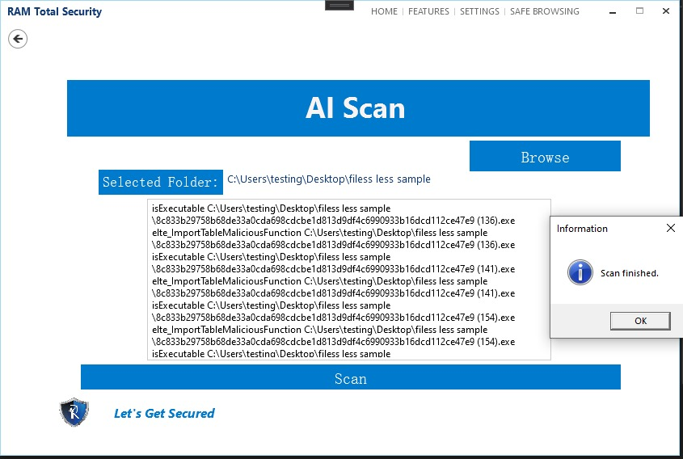

# File_Less_Malware
Fileless malware, also known as memory-resident or non-file-based malware, is a type of malicious software that operates in a computer's memory without leaving a trace on the hard drive.

## Introduction

Fileless malware, also known as memory-resident or non-file-based malware, is a type of malicious software that operates in a computer's memory without leaving a trace on the hard drive. This stealthy malware uses legitimate system tools and processes to execute its malicious actions, making it difficult to detect and remove using traditional antivirus methods.
Fileless malware is a sophisticated and stealthy category of malicious software that operates without the need for traditional files or executables on a victim's computer. Instead of residing in files on the hard drive, fileless malware operates primarily in the computer's volatile memory (RAM) or leverages legitimate system tools and processes to carry out its malicious activities

## Features

- Selected The Folder.
- Scan The Folder.
- Detected The File Less Malware.
  


## Getting Started

To get started with Ai Scan, you need to clone the repository and build the application using Visual Studio or your preferred C# development environment.

### Prerequisites

- Visual Studio or another C# development environment.
- .NET Framework.

### Installation

1. Clone the repository:
   ```shell
   git clone https://github.com/rjghongade/File_Less-Malware.git

1. Open the project in Visual Studio.

2. Build and run the application.

### Usage
1. Launch the application.
2. Browse The Folder.
3. Select a folder To Scan.
4. Scan the folder by clicking the "Scan " button.
5. Then show the result on The Text Box File Less Malware Path.

### Contributing
Contributions are welcome. Please submit bug reports or feature requests through the GitHub issue tracker.

1. In-Memory Operations: Fileless malware conducts its malicious operations entirely within the computer's memory. This means that it doesn't create files on the hard drive, making it challenging to detect and remove using traditional antivirus or anti-malware tools.

2. Stealthy Execution: It employs various techniques to avoid detection, including exploiting vulnerabilities, using scripting languages, and manipulating legitimate system processes. By doing so, fileless malware can remain hidden from security software that scans files on the disk.

3. No Disk Footprint: One of the key characteristics of fileless malware is its lack of a noticeable footprint on the disk. This makes it harder to track, as it doesn't leave behind any traditional traces that security tools typically look for.

4. Memory-Resident Payloads: The malware typically loads its malicious payload directly into memory, where it can interact with running processes and systems. This allows it to execute its actions without relying on external files.

5. Exploiting Legitimate Tools: Fileless malware often uses legitimate, built-in tools and processes, such as PowerShell, Windows Management Instrumentation (WMI), or JavaScript, to carry out malicious activities. This blending with legitimate processes helps it evade detection.

6. Evasion of Signature-Based Detection: Traditional antivirus software relies on signatures or patterns to detect known malware. Fileless malware, being file-less, doesn't match these signatures, making it harder to identify using traditional methods.

7. Memory Scrubbing: Some fileless malware is designed to clean up or erase traces from memory after execution to further evade detection. This makes it challenging to investigate post-incident.

8. Targeted Attacks: Fileless malware is often associated with advanced persistent threats (APTs) and targeted attacks. It allows threat actors to infiltrate a system, gather information, and exfiltrate data without leaving detectable traces.

9. Protection and Detection Challenges: Detecting and protecting against fileless malware requires advanced security measures, such as behavior-based analysis, anomaly detection, and continuous monitoring of system activities.

10. Mitigation: Mitigating the risks of fileless malware involves proactive security practices, regular software and system updates, limiting user privileges, and using advanced endpoint security solutions that can detect and respond to unusual behaviors.

[Folder_Locker](https://github.com/rjghongade/File_Less-Malware.git)

### Social Media

[Linkdin](https://www.linkedin.com/in/rajendra-ghongade-07b337259?utm_source=share&utm_campaign=share_via&utm_content=profile&utm_medium=android_app)

[RAM Antivirus](https://www.linkedin.com/company/ram-ultimate-antivirus/)

### Work On Ram Antivirus Jalgaon, Maharastra.
[Ram_Antivirus](https://ramantivirus.com/)

Note:- I Have Use The All Update In Ram Antivirus [link](https://ramantivirus.com/)


   


